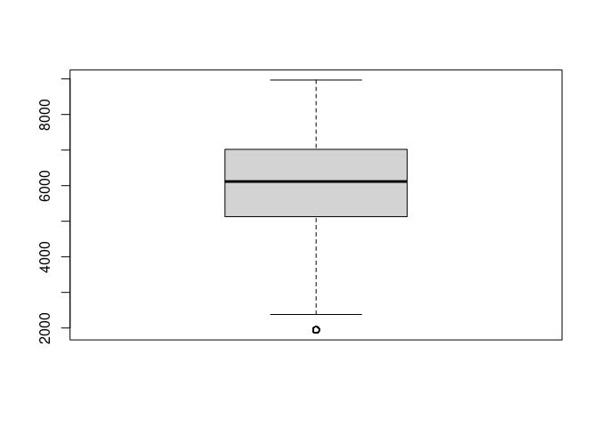
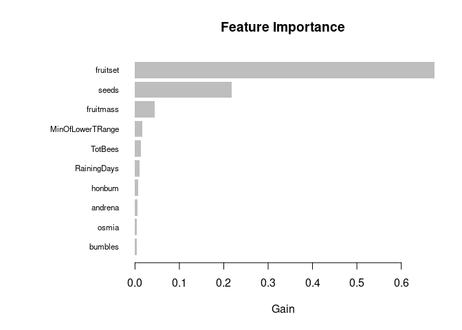

Blueberry LightGBM
================
Jeremy Haakenson
2023-05-24

This R Markdown file shows my approach to Kaggle Playground Series
Season 3, Episode 14, in which I predicted blueberry yield based on
numeric variables.

Load packages.

``` r
library(skimr)
library(scales)
library(dplyr)
library(lightgbm)
```

Read in the files.

``` r
train = read.csv('train.csv')
test = read.csv('test.csv')
```

Explore the data.

``` r
skim(train)
```

|                                                  |       |
|:-------------------------------------------------|:------|
| Name                                             | train |
| Number of rows                                   | 15289 |
| Number of columns                                | 18    |
| \_\_\_\_\_\_\_\_\_\_\_\_\_\_\_\_\_\_\_\_\_\_\_   |       |
| Column type frequency:                           |       |
| numeric                                          | 18    |
| \_\_\_\_\_\_\_\_\_\_\_\_\_\_\_\_\_\_\_\_\_\_\_\_ |       |
| Group variables                                  | None  |

Data summary

**Variable type: numeric**

| skim_variable | n_missing | complete_rate | mean | sd | p0 | p25 | p50 | p75 | p100 | hist |
|:---|---:|---:|---:|---:|---:|---:|---:|---:|---:|:---|
| id | 0 | 1 | 7644.00 | 4413.70 | 0.00 | 3822.00 | 7644.00 | 11466.00 | 15288.00 | ▇▇▇▇▇ |
| clonesize | 0 | 1 | 19.70 | 6.60 | 10.00 | 12.50 | 25.00 | 25.00 | 40.00 | ▆▁▇▁▁ |
| honeybee | 0 | 1 | 0.39 | 0.36 | 0.00 | 0.25 | 0.50 | 0.50 | 18.43 | ▇▁▁▁▁ |
| bumbles | 0 | 1 | 0.29 | 0.06 | 0.00 | 0.25 | 0.25 | 0.38 | 0.58 | ▁▁▇▃▁ |
| andrena | 0 | 1 | 0.49 | 0.15 | 0.00 | 0.38 | 0.50 | 0.63 | 0.75 | ▁▃▇▇▇ |
| osmia | 0 | 1 | 0.59 | 0.14 | 0.00 | 0.50 | 0.63 | 0.75 | 0.75 | ▁▁▁▅▇ |
| MaxOfUpperTRange | 0 | 1 | 82.17 | 9.15 | 69.70 | 77.40 | 86.00 | 86.00 | 94.60 | ▇▇▁▇▇ |
| MinOfUpperTRange | 0 | 1 | 49.67 | 5.55 | 39.00 | 46.80 | 52.00 | 52.00 | 57.20 | ▇▁▇▇▇ |
| AverageOfUpperTRange | 0 | 1 | 68.66 | 7.64 | 58.20 | 64.70 | 71.90 | 71.90 | 79.00 | ▇▇▁▇▇ |
| MaxOfLowerTRange | 0 | 1 | 59.23 | 6.61 | 50.20 | 55.80 | 62.00 | 62.00 | 68.20 | ▇▇▁▇▇ |
| MinOfLowerTRange | 0 | 1 | 28.66 | 3.20 | 24.30 | 27.00 | 30.00 | 30.00 | 33.00 | ▇▇▁▇▇ |
| AverageOfLowerTRange | 0 | 1 | 48.57 | 5.39 | 41.20 | 45.80 | 50.80 | 50.80 | 55.90 | ▇▇▁▇▇ |
| RainingDays | 0 | 1 | 18.66 | 11.66 | 1.00 | 16.00 | 16.00 | 24.00 | 34.00 | ▆▁▇▇▆ |
| AverageRainingDays | 0 | 1 | 0.32 | 0.16 | 0.06 | 0.26 | 0.26 | 0.39 | 0.56 | ▆▇▁▇▆ |
| fruitset | 0 | 1 | 0.50 | 0.07 | 0.19 | 0.46 | 0.51 | 0.56 | 0.65 | ▁▁▅▇▅ |
| fruitmass | 0 | 1 | 0.45 | 0.04 | 0.31 | 0.42 | 0.45 | 0.47 | 0.54 | ▁▂▇▇▂ |
| seeds | 0 | 1 | 36.16 | 4.03 | 22.08 | 33.23 | 36.04 | 39.16 | 46.59 | ▁▃▇▇▂ |
| yield | 0 | 1 | 6025.19 | 1337.06 | 1945.53 | 5128.16 | 6117.48 | 7019.69 | 8969.40 | ▁▃▇▇▃ |

``` r
skim(test)
```

|                                                  |       |
|:-------------------------------------------------|:------|
| Name                                             | test  |
| Number of rows                                   | 10194 |
| Number of columns                                | 17    |
| \_\_\_\_\_\_\_\_\_\_\_\_\_\_\_\_\_\_\_\_\_\_\_   |       |
| Column type frequency:                           |       |
| numeric                                          | 17    |
| \_\_\_\_\_\_\_\_\_\_\_\_\_\_\_\_\_\_\_\_\_\_\_\_ |       |
| Group variables                                  | None  |

Data summary

**Variable type: numeric**

| skim_variable | n_missing | complete_rate | mean | sd | p0 | p25 | p50 | p75 | p100 | hist |
|:---|---:|---:|---:|---:|---:|---:|---:|---:|---:|:---|
| id | 0 | 1 | 20385.50 | 2942.90 | 15289.00 | 17837.25 | 20385.50 | 22933.75 | 25482.00 | ▇▇▇▇▇ |
| clonesize | 0 | 1 | 19.80 | 6.59 | 10.00 | 12.50 | 25.00 | 25.00 | 37.50 | ▆▁▇▁▁ |
| honeybee | 0 | 1 | 0.39 | 0.39 | 0.00 | 0.25 | 0.50 | 0.50 | 18.43 | ▇▁▁▁▁ |
| bumbles | 0 | 1 | 0.29 | 0.06 | 0.00 | 0.25 | 0.25 | 0.38 | 0.58 | ▁▁▇▃▁ |
| andrena | 0 | 1 | 0.49 | 0.15 | 0.00 | 0.38 | 0.50 | 0.63 | 0.75 | ▁▃▇▇▇ |
| osmia | 0 | 1 | 0.59 | 0.14 | 0.00 | 0.50 | 0.63 | 0.75 | 0.75 | ▁▁▁▃▇ |
| MaxOfUpperTRange | 0 | 1 | 82.21 | 9.15 | 69.70 | 77.40 | 86.00 | 86.00 | 94.60 | ▇▇▁▇▇ |
| MinOfUpperTRange | 0 | 1 | 49.70 | 5.55 | 39.00 | 46.80 | 52.00 | 52.00 | 57.20 | ▇▁▇▇▇ |
| AverageOfUpperTRange | 0 | 1 | 68.69 | 7.65 | 58.20 | 64.70 | 71.90 | 71.90 | 79.00 | ▇▇▁▇▇ |
| MaxOfLowerTRange | 0 | 1 | 59.26 | 6.62 | 50.20 | 55.80 | 62.00 | 62.00 | 68.20 | ▇▇▁▇▇ |
| MinOfLowerTRange | 0 | 1 | 28.67 | 3.20 | 24.30 | 27.00 | 30.00 | 30.00 | 33.00 | ▇▇▁▇▇ |
| AverageOfLowerTRange | 0 | 1 | 48.59 | 5.40 | 41.20 | 45.80 | 50.80 | 50.80 | 55.90 | ▇▇▁▇▇ |
| RainingDays | 0 | 1 | 18.51 | 11.78 | 1.00 | 16.00 | 16.00 | 24.00 | 34.00 | ▇▁▇▇▆ |
| AverageRainingDays | 0 | 1 | 0.32 | 0.17 | 0.06 | 0.26 | 0.26 | 0.39 | 0.56 | ▇▇▁▇▆ |
| fruitset | 0 | 1 | 0.50 | 0.07 | 0.23 | 0.46 | 0.51 | 0.56 | 0.65 | ▁▂▆▇▅ |
| fruitmass | 0 | 1 | 0.45 | 0.04 | 0.31 | 0.42 | 0.45 | 0.47 | 0.54 | ▁▃▇▇▃ |
| seeds | 0 | 1 | 36.14 | 4.02 | 24.32 | 33.23 | 36.01 | 39.13 | 46.14 | ▁▅▇▆▂ |

There are no missing values. All variables are numeric. Although some
could be changed to categorical, I think it makes sense to leave them as
they are.

Look for correlation between variables.

``` r
cor(train)
```

    ##                                id    clonesize     honeybee      bumbles
    ## id                   1.0000000000  0.003041312  0.013690069  0.003244472
    ## clonesize            0.0030413122  1.000000000  0.304130051  0.080433498
    ## honeybee             0.0136900693  0.304130051  1.000000000 -0.017936722
    ## bumbles              0.0032444715  0.080433498 -0.017936722  1.000000000
    ## andrena              0.0089477133  0.065131023  0.030670945 -0.164962018
    ## osmia                0.0046927160 -0.007607181 -0.010394350  0.158001303
    ## MaxOfUpperTRange     0.0095279937  0.016159070  0.005839597 -0.002104211
    ## MinOfUpperTRange     0.0096131642  0.015838038  0.005755236 -0.001812872
    ## AverageOfUpperTRange 0.0095043715  0.016056997  0.005892387 -0.001769005
    ## MaxOfLowerTRange     0.0097558870  0.016342525  0.005942369 -0.001612852
    ## MinOfLowerTRange     0.0095443278  0.016026385  0.005809391 -0.001803635
    ## AverageOfLowerTRange 0.0096077561  0.015987173  0.005485163 -0.001644275
    ## RainingDays          0.0023403650  0.165769726  0.046494235 -0.063293537
    ## AverageRainingDays   0.0017027982  0.164822694  0.037532268 -0.060232135
    ## fruitset             0.0060606470 -0.406792694 -0.120491503  0.160446977
    ## fruitmass            0.0047597780 -0.377687654 -0.135310003  0.163986722
    ## seeds                0.0008668661 -0.396897969 -0.139261464  0.177022340
    ## yield                0.0009746864 -0.382618530 -0.118001162  0.161144599
    ##                           andrena        osmia MaxOfUpperTRange
    ## id                    0.008947713  0.004692716      0.009527994
    ## clonesize             0.065131023 -0.007607181      0.016159070
    ## honeybee              0.030670945 -0.010394350      0.005839597
    ## bumbles              -0.164962018  0.158001303     -0.002104211
    ## andrena               1.000000000  0.309556250     -0.013060789
    ## osmia                 0.309556250  1.000000000     -0.031391381
    ## MaxOfUpperTRange     -0.013060789 -0.031391381      1.000000000
    ## MinOfUpperTRange     -0.012927634 -0.030819340      0.998599230
    ## AverageOfUpperTRange -0.012993160 -0.031415115      0.999806256
    ## MaxOfLowerTRange     -0.012924043 -0.031398176      0.999502906
    ## MinOfLowerTRange     -0.013034574 -0.031486061      0.999828811
    ## AverageOfLowerTRange -0.013070964 -0.031337226      0.999772219
    ## RainingDays          -0.026571846 -0.079873589      0.011322422
    ## AverageRainingDays   -0.027192535 -0.078720187      0.010351960
    ## fruitset              0.073669223  0.209495155      0.007580489
    ## fruitmass             0.064721769  0.192209797      0.146236968
    ## seeds                 0.063504039  0.200597300      0.060962568
    ## yield                 0.073969462  0.198264399     -0.022516890
    ##                      MinOfUpperTRange AverageOfUpperTRange MaxOfLowerTRange
    ## id                        0.009613164          0.009504371      0.009755887
    ## clonesize                 0.015838038          0.016056997      0.016342525
    ## honeybee                  0.005755236          0.005892387      0.005942369
    ## bumbles                  -0.001812872         -0.001769005     -0.001612852
    ## andrena                  -0.012927634         -0.012993160     -0.012924043
    ## osmia                    -0.030819340         -0.031415115     -0.031398176
    ## MaxOfUpperTRange          0.998599230          0.999806256      0.999502906
    ## MinOfUpperTRange          1.000000000          0.999004453      0.998199013
    ## AverageOfUpperTRange      0.999004453          1.000000000      0.999464646
    ## MaxOfLowerTRange          0.998199013          0.999464646      1.000000000
    ## MinOfLowerTRange          0.998953494          0.999972789      0.999489360
    ## AverageOfLowerTRange      0.999039911          0.999973889      0.999423260
    ## RainingDays               0.011727031          0.011244775      0.011302488
    ## AverageRainingDays        0.010767478          0.010260405      0.010262373
    ## fruitset                  0.008409266          0.008502596      0.007901735
    ## fruitmass                 0.147203402          0.147676090      0.146668079
    ## seeds                     0.061811852          0.062082291      0.061378495
    ## yield                    -0.021928672         -0.021939750     -0.022196509
    ##                      MinOfLowerTRange AverageOfLowerTRange  RainingDays
    ## id                        0.009544328          0.009607756  0.002340365
    ## clonesize                 0.016026385          0.015987173  0.165769726
    ## honeybee                  0.005809391          0.005485163  0.046494235
    ## bumbles                  -0.001803635         -0.001644275 -0.063293537
    ## andrena                  -0.013034574         -0.013070964 -0.026571846
    ## osmia                    -0.031486061         -0.031337226 -0.079873589
    ## MaxOfUpperTRange          0.999828811          0.999772219  0.011322422
    ## MinOfUpperTRange          0.998953494          0.999039911  0.011727031
    ## AverageOfUpperTRange      0.999972789          0.999973889  0.011244775
    ## MaxOfLowerTRange          0.999489360          0.999423260  0.011302488
    ## MinOfLowerTRange          1.000000000          0.999963494  0.011465581
    ## AverageOfLowerTRange      0.999963494          1.000000000  0.011334147
    ## RainingDays               0.011465581          0.011334147  1.000000000
    ## AverageRainingDays        0.010478703          0.010355227  0.990864369
    ## fruitset                  0.007908770          0.008329030 -0.468066090
    ## fruitmass                 0.146704082          0.147362786 -0.447032585
    ## seeds                     0.061360332          0.061852960 -0.478818309
    ## yield                    -0.022319384         -0.022080576 -0.477191308
    ##                      AverageRainingDays     fruitset    fruitmass         seeds
    ## id                          0.001702798  0.006060647  0.004759778  0.0008668661
    ## clonesize                   0.164822694 -0.406792694 -0.377687654 -0.3968979687
    ## honeybee                    0.037532268 -0.120491503 -0.135310003 -0.1392614645
    ## bumbles                    -0.060232135  0.160446977  0.163986722  0.1770223398
    ## andrena                    -0.027192535  0.073669223  0.064721769  0.0635040395
    ## osmia                      -0.078720187  0.209495155  0.192209797  0.2005972998
    ## MaxOfUpperTRange            0.010351960  0.007580489  0.146236968  0.0609625678
    ## MinOfUpperTRange            0.010767478  0.008409266  0.147203402  0.0618118520
    ## AverageOfUpperTRange        0.010260405  0.008502596  0.147676090  0.0620822914
    ## MaxOfLowerTRange            0.010262373  0.007901735  0.146668079  0.0613784948
    ## MinOfLowerTRange            0.010478703  0.007908770  0.146704082  0.0613603322
    ## AverageOfLowerTRange        0.010355227  0.008329030  0.147362786  0.0618529601
    ## RainingDays                 0.990864369 -0.468066090 -0.447032585 -0.4788183094
    ## AverageRainingDays          1.000000000 -0.475876381 -0.452870310 -0.4844393705
    ## fruitset                   -0.475876381  1.000000000  0.936988317  0.9296544464
    ## fruitmass                  -0.452870310  0.936988317  1.000000000  0.9316463815
    ## seeds                      -0.484439370  0.929654446  0.931646381  1.0000000000
    ## yield                      -0.483870198  0.885966709  0.826480792  0.8688531295
    ##                              yield
    ## id                    0.0009746864
    ## clonesize            -0.3826185297
    ## honeybee             -0.1180011621
    ## bumbles               0.1611445990
    ## andrena               0.0739694617
    ## osmia                 0.1982643992
    ## MaxOfUpperTRange     -0.0225168898
    ## MinOfUpperTRange     -0.0219286724
    ## AverageOfUpperTRange -0.0219397504
    ## MaxOfLowerTRange     -0.0221965085
    ## MinOfLowerTRange     -0.0223193843
    ## AverageOfLowerTRange -0.0220805765
    ## RainingDays          -0.4771913078
    ## AverageRainingDays   -0.4838701985
    ## fruitset              0.8859667093
    ## fruitmass             0.8264807922
    ## seeds                 0.8688531295
    ## yield                 1.0000000000

The temperature variables are all highly correlated, as are the 2 rain
variables. Also, fruitset, fruitmass, and seeds are all highly
correlated. I will run a preliminary linear regression to pick the best
variable from each of those 3 groups.

``` r
lin1 = lm(yield ~ . -id, data = train)
summary(lin1)
```

    ## 
    ## Call:
    ## lm(formula = yield ~ . - id, data = train)
    ## 
    ## Residuals:
    ##     Min      1Q  Median      3Q     Max 
    ## -5623.1  -231.9   -16.1   218.1  5229.8 
    ## 
    ## Coefficients:
    ##                        Estimate Std. Error t value Pr(>|t|)    
    ## (Intercept)          -1.132e+03  1.003e+02 -11.287  < 2e-16 ***
    ## clonesize            -4.502e+00  8.388e-01  -5.367 8.11e-08 ***
    ## honeybee             -2.199e+00  1.380e+01  -0.159 0.873396    
    ## bumbles               3.702e+02  8.445e+01   4.383 1.18e-05 ***
    ## andrena               1.212e+02  3.468e+01   3.495 0.000475 ***
    ## osmia                 5.548e+01  3.703e+01   1.498 0.134098    
    ## MaxOfUpperTRange      3.808e+01  3.012e+01   1.264 0.206161    
    ## MinOfUpperTRange      3.066e+01  2.012e+01   1.524 0.127431    
    ## AverageOfUpperTRange -3.398e+02  1.077e+02  -3.156 0.001602 ** 
    ## MaxOfLowerTRange      1.139e+01  2.371e+01   0.480 0.631094    
    ## MinOfLowerTRange      9.141e+02  2.331e+02   3.921 8.86e-05 ***
    ## AverageOfLowerTRange -1.755e+02  1.328e+02  -1.322 0.186335    
    ## RainingDays          -8.779e-02  3.013e+00  -0.029 0.976759    
    ## AverageRainingDays   -4.901e+02  2.154e+02  -2.275 0.022896 *  
    ## fruitset              1.178e+04  2.193e+02  53.707  < 2e-16 ***
    ## fruitmass            -7.426e+03  4.542e+02 -16.352  < 2e-16 ***
    ## seeds                 1.364e+02  3.661e+00  37.251  < 2e-16 ***
    ## ---
    ## Signif. codes:  0 '***' 0.001 '**' 0.01 '*' 0.05 '.' 0.1 ' ' 1
    ## 
    ## Residual standard error: 583 on 15272 degrees of freedom
    ## Multiple R-squared:  0.8101, Adjusted R-squared:  0.8099 
    ## F-statistic:  4072 on 16 and 15272 DF,  p-value: < 2.2e-16

The best temp. variable is MinOfLowerTRange. The best rain variable is
RainingDays. The best variable from the third group is fruitset.

Remove highly correlated variables.

``` r
train.new = train[, c(1:6, 11, 13, 15, 18)]
test.new = test[, c(1:6, 11, 13, 15)]
```

Scale the data.

``` r
train.scale = scale(train.new[, 2:9])
train.scale = cbind.data.frame(train$id, train.scale, train$yield)
colnames(train.scale)[1] = 'id'
colnames(train.scale)[10] = 'yield'
test.scale = scale(test.new[, 2:9])
test.scale = cbind.data.frame(test$id, test.scale)
colnames(test.scale)[1] = 'id'
```

FEATURE ENGINEERING

Add a variable for the total number of bees.

``` r
train.scale$TotBees = scale(train.scale$honeybee + train.scale$bumbles +
                              train.scale$andrena +  train.scale$osmia)
head(train.scale)
```

    ##   id  clonesize   honeybee    bumbles    andrena      osmia MinOfLowerTRange
    ## 1  0  0.8029024  0.3060634 -0.6136444 1.73732964 -0.6620986       -1.3646489
    ## 2  1  0.8029024  0.3060634 -0.6136444 0.04945219 -0.6620986       -1.3646489
    ## 3  2 -1.0924123 -0.3852259 -0.6136444 0.92714847  0.2698744        0.4191840
    ## 4  3 -1.0924123 -0.3852259 -0.6136444 0.92714847 -0.6620986       -0.5196754
    ## 5  4  0.8029024  0.3060634 -0.6136444 0.92714847  0.2698744       -0.5196754
    ## 6  5  0.8029024  0.3060634 -0.6136444 0.92714847  1.1301571        1.3580435
    ##   RainingDays   fruitset    yield     TotBees
    ## 1   0.4579968 -1.0449040 4476.811  0.35753530
    ## 2   0.4579968 -0.7774287 5548.122 -0.42859861
    ## 3   0.4579968  0.6746365 6869.778  0.09229015
    ## 4   0.4579968  0.8500596 6880.776 -0.34177901
    ## 5   0.4579968  1.0342272 7479.934  0.41426018
    ## 6   1.3158076  0.8401510 7267.283  0.81493940

``` r
test.scale$TotBees = scale(test.scale$honeybee + test.scale$bumbles +
                              test.scale$andrena +  test.scale$osmia)
head(test.scale)
```

    ##      id  clonesize   honeybee    bumbles    andrena      osmia MinOfLowerTRange
    ## 1 15289  0.7894643 -0.3630705 -0.6064728 -1.6287649 -2.4533852        0.4143539
    ## 2 15290 -1.1068126 -0.3630705 -0.6064728  1.7458194  0.2628944        1.3523573
    ## 3 15291 -1.1068126 -0.3630705 -0.6064728  0.9359191  0.2628944        0.4143539
    ## 4 15292  0.7894643  0.2779186  1.5650237 -0.7513730  0.2628944        0.4143539
    ## 5 15293  2.6857413  0.9189077 -0.6064728 -1.6287649 -2.4533852        1.3523573
    ## 6 15294 -1.1068126 -0.3630705 -0.6064728  1.7458194  1.1206670        1.3523573
    ##   RainingDays   fruitset    TotBees
    ## 1   0.4662653 -1.3712508 -2.3419371
    ## 2  -1.4861842 -0.1841978  0.4817537
    ## 3  -0.2128476  1.0918685  0.1062884
    ## 4  -0.2128476 -0.9208593  0.6279219
    ## 5   0.4662653 -1.8848766 -1.7476191
    ## 6   1.3151564 -0.6679203  0.8794123

Log transform TotBees to increase the spread.

``` r
train.scale$TotBees = log(train.scale$TotBees + 6)
test.scale$TotBees = log(test.scale$TotBees + 6)
```

Make a variable of honeybee \* bumbles, as suggested by New Bing.

``` r
train.scale$honbum = scale(train.scale$honeybee * train.scale$bumbles)
test.scale$honbum = scale(test.scale$honeybee * test.scale$bumbles)
```

Look for correlation with new feature.

``` r
cor(train.scale)
```

    ##                             id     clonesize     honeybee      bumbles
    ## id                1.0000000000  0.0030413122  0.013690069  0.003244472
    ## clonesize         0.0030413122  1.0000000000  0.304130051  0.080433498
    ## honeybee          0.0136900693  0.3041300514  1.000000000 -0.017936722
    ## bumbles           0.0032444715  0.0804334982 -0.017936722  1.000000000
    ## andrena           0.0089477133  0.0651310233  0.030670945 -0.164962018
    ## osmia             0.0046927160 -0.0076071807 -0.010394350  0.158001303
    ## MinOfLowerTRange  0.0095443278  0.0160263854  0.005809391 -0.001803635
    ## RainingDays       0.0023403650  0.1657697258  0.046494235 -0.063293537
    ## fruitset          0.0060606470 -0.4067926935 -0.120491503  0.160446977
    ## yield             0.0009746864 -0.3826185297 -0.118001162  0.161144599
    ## TotBees           0.0132825439  0.1859754220  0.288580854  0.463927165
    ## honbum           -0.0111428815 -0.0001696773 -0.804976842  0.085896950
    ##                       andrena        osmia MinOfLowerTRange  RainingDays
    ## id                0.008947713  0.004692716      0.009544328  0.002340365
    ## clonesize         0.065131023 -0.007607181      0.016026385  0.165769726
    ## honeybee          0.030670945 -0.010394350      0.005809391  0.046494235
    ## bumbles          -0.164962018  0.158001303     -0.001803635 -0.063293537
    ## andrena           1.000000000  0.309556250     -0.013034574 -0.026571846
    ## osmia             0.309556250  1.000000000     -0.031486061 -0.079873589
    ## MinOfLowerTRange -0.013034574 -0.031486061      1.000000000  0.011465581
    ## RainingDays      -0.026571846 -0.079873589      0.011465581  1.000000000
    ## fruitset          0.073669223  0.209495155      0.007908770 -0.468066090
    ## yield             0.073969462  0.198264399     -0.022319384 -0.477191308
    ## TotBees           0.584444039  0.741694157     -0.021763524 -0.058418413
    ## honbum            0.031063589  0.067769959     -0.004156894  0.004255748
    ##                      fruitset         yield     TotBees        honbum
    ## id                0.006060647  0.0009746864  0.01328254 -0.0111428815
    ## clonesize        -0.406792694 -0.3826185297  0.18597542 -0.0001696773
    ## honeybee         -0.120491503 -0.1180011621  0.28858085 -0.8049768423
    ## bumbles           0.160446977  0.1611445990  0.46392717  0.0858969502
    ## andrena           0.073669223  0.0739694617  0.58444404  0.0310635887
    ## osmia             0.209495155  0.1982643992  0.74169416  0.0677699590
    ## MinOfLowerTRange  0.007908770 -0.0223193843 -0.02176352 -0.0041568945
    ## RainingDays      -0.468066090 -0.4771913078 -0.05841841  0.0042557479
    ## fruitset          1.000000000  0.8859667093  0.17520488  0.0092395806
    ## yield             0.885966709  1.0000000000  0.16727938  0.0146549393
    ## TotBees           0.175204885  0.1672793826  1.00000000 -0.1337316829
    ## honbum            0.009239581  0.0146549393 -0.13373168  1.0000000000

honbum is highly correlated with honeybee. I will remove one of them.

``` r
lin2 = lm(yield ~ . -id, data = train.scale)
summary(lin2)
```

    ## 
    ## Call:
    ## lm(formula = yield ~ . - id, data = train.scale)
    ## 
    ## Residuals:
    ##     Min      1Q  Median      3Q     Max 
    ## -5451.8  -248.4   -19.0   228.6  5254.6 
    ## 
    ## Coefficients:
    ##                  Estimate Std. Error t value Pr(>|t|)    
    ## (Intercept)      7498.125    301.023  24.909  < 2e-16 ***
    ## clonesize         -40.854      6.360  -6.424 1.37e-10 ***
    ## honeybee           38.147     12.738   2.995  0.00275 ** 
    ## bumbles           105.047     15.049   6.980 3.06e-12 ***
    ## andrena            92.295     15.802   5.841 5.31e-09 ***
    ## osmia              88.653     16.684   5.314 1.09e-07 ***
    ## MinOfLowerTRange  -35.973      4.931  -7.296 3.11e-13 ***
    ## RainingDays      -107.240      5.590 -19.185  < 2e-16 ***
    ## fruitset         1106.463      6.289 175.937  < 2e-16 ***
    ## TotBees          -828.964    169.393  -4.894 9.99e-07 ***
    ## honbum              2.590      9.317   0.278  0.78103    
    ## ---
    ## Signif. codes:  0 '***' 0.001 '**' 0.01 '*' 0.05 '.' 0.1 ' ' 1
    ## 
    ## Residual standard error: 609 on 15278 degrees of freedom
    ## Multiple R-squared:  0.7927, Adjusted R-squared:  0.7926 
    ## F-statistic:  5842 on 10 and 15278 DF,  p-value: < 2.2e-16

honbum is better than honeybee. Remove honeybee.

``` r
train.scale['honeybee'] = NULL
test.scale['honeybee'] = NULL
```

Perform feature selection on a per model basis.

Add fruitmass and seeds back to the data since they are highly
correlated with yield.

``` r
train.scale$fruitmass = scale(train$fruitmass)
train.scale$seeds = scale(train$seeds)
test.scale$fruitmass = scale(test$fruitmass)
test.scale$seeds = scale(test$seeds)
```

Look for outliers in yield (the target variable).

``` r
boxplot(train.scale$yield)
```

<!-- -->

There is 1 low outlier value in yield.

Change yields of 1945.531 to 2379.905 (the next lowest value).

``` r
train.out = train.scale
train.out$yield[train.out$yield == 1945.53061] = 2379.90521   
```

Optimize LightGBM parameters.

``` r
train.light = lgb.Dataset(as.matrix(train.out[, c(2:8, 10:13)]), 
                          label = train.out$yield)

test.light = as.matrix(test.scale[, 2:12])

set.seed(12)
lgb4 = lgb.cv(params = list(objective = 'regression_l1',
                            metric = 'mae',
                            min_data = 1L,
                            learning_rate = .003,
                            num_leaves = 16,
                            max_depth = 6,
                            feature_fraction = .8,
                            bagging_fraction = .921,
                            bagging_freq = 5),
              nrounds = 53000,
              train.light,
              nfold = 9,
              early_stopping_rounds = 16,
              verbose = -1)
```

Note: I set early_stopping_rounds to 16 here to reduce the number of
warning messages from lightgbm. Originally, early_stopping_rounds was
set to 1000.

Make final LightGBM model.

``` r
set.seed(12)
lgb5 = lightgbm(train.light,
                params = list(objective = 'regression_l1',
                              metric = 'mae',
                              min_data = 1L,
                              learning_rate = .003,
                              num_leaves = 16,
                              max_depth = 6,
                              feature_fraction = .8,
                              bagging_fraction = .921,
                              bagging_freq = 5),
                nrounds = 10183,
                verbose = -1)
```

    ## Warning in .get_default_num_threads(): Optional package 'RhpcBLASctl' not
    ## found. Will use default number of OpenMP threads.

Predict with lgb5.

``` r
lgb5.yield = predict(lgb5, test.light)
range(train$yield)
```

    ## [1] 1945.531 8969.402

``` r
range(lgb5.yield)
```

    ## [1] 2373.508 8780.138

``` r
lgb5.guess = cbind.data.frame(test$id, lgb5.yield)
write.csv(lgb5.guess, 'lgb5.csv', row.names = F)
```

Plot feature importance for lgb5.

``` r
tree_imp = lgb.importance(lgb5, percentage = TRUE)
lgb.plot.importance(tree_imp, measure = "Gain")
```

<!-- -->
