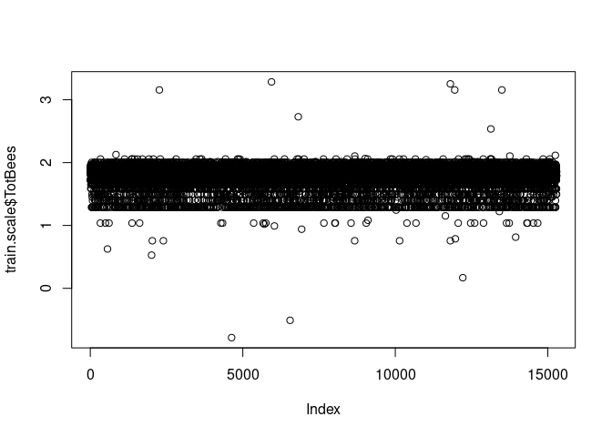

Blueberry Robust Regression
================

Load packages.

``` r
library(dplyr)
```

    ## 
    ## Attaching package: 'dplyr'

    ## The following objects are masked from 'package:stats':
    ## 
    ##     filter, lag

    ## The following objects are masked from 'package:base':
    ## 
    ##     intersect, setdiff, setequal, union

``` r
library(MASS)
```

    ## 
    ## Attaching package: 'MASS'

    ## The following object is masked from 'package:dplyr':
    ## 
    ##     select

Load data.

``` r
train = read.csv("train.csv")
test = read.csv("test.csv")
```

Remove highly correlated variables.

``` r
train.new = train[, c(1:6, 11, 13, 15:18)]
head(train.new)
```

    ##   id clonesize honeybee bumbles andrena osmia MinOfLowerTRange RainingDays
    ## 1  0      25.0     0.50    0.25    0.75  0.50             24.3          24
    ## 2  1      25.0     0.50    0.25    0.50  0.50             24.3          24
    ## 3  2      12.5     0.25    0.25    0.63  0.63             30.0          24
    ## 4  3      12.5     0.25    0.25    0.63  0.50             27.0          24
    ## 5  4      25.0     0.50    0.25    0.63  0.63             27.0          24
    ## 6  5      25.0     0.50    0.25    0.63  0.75             33.0          34
    ##    fruitset fruitmass    seeds    yield
    ## 1 0.4250109 0.4175454 32.46089 4476.811
    ## 2 0.4449083 0.4220514 33.85832 5548.122
    ## 3 0.5529268 0.4708529 38.34178 6869.778
    ## 4 0.5659765 0.4781366 39.46756 6880.776
    ## 5 0.5796766 0.4941648 40.48451 7479.934
    ## 6 0.5652394 0.4843495 40.55502 7267.283

``` r
test.new = test[, c(1:6, 11, 13, 15:17)] 
head(test.new)
```

    ##      id clonesize honeybee bumbles andrena osmia MinOfLowerTRange RainingDays
    ## 1 15289      25.0     0.25    0.25    0.25  0.25               30          24
    ## 2 15290      12.5     0.25    0.25    0.75  0.63               33           1
    ## 3 15291      12.5     0.25    0.25    0.63  0.63               30          16
    ## 4 15292      25.0     0.50    0.38    0.38  0.63               30          16
    ## 5 15293      37.5     0.75    0.25    0.25  0.25               33          24
    ## 6 15294      12.5     0.25    0.25    0.75  0.75               33          34
    ##    fruitset fruitmass    seeds
    ## 1 0.3993670 0.4080881 31.39457
    ## 2 0.4880479 0.4428656 36.84696
    ## 3 0.5833787 0.4870568 40.03764
    ## 4 0.4330143 0.4228466 33.11609
    ## 5 0.3609957 0.3888603 29.55802
    ## 6 0.4519106 0.4356208 32.81456

Scale the data.

``` r
train.scale = scale(train.new[, 2:11])
train.scale = cbind.data.frame(train$id, train.scale, train$yield)
colnames(train.scale)[1] = 'id'
colnames(train.scale)[12] = 'yield'
test.scale = scale(test.new[, 2:11])
test.scale = cbind.data.frame(test$id, test.scale)
colnames(test.scale)[1] = 'id'
```

**Feature Engineering**

Add a variable for the total number of bees.

``` r
train.scale$TotBees = scale(train.scale$honeybee + train.scale$bumbles +
                              train.scale$andrena +  train.scale$osmia)
plot(train.scale$TotBees)
```

<!-- -->

``` r
train.scale$TotBees = log(train.scale$TotBees + 6)
plot(train.scale$TotBees)
```

<!-- -->

``` r
test.scale$TotBees = scale(test.scale$honeybee + test.scale$bumbles +
                              test.scale$andrena +  test.scale$osmia)
test.scale$TotBees = log(test.scale$TotBees + 6)
```

Make a variable of honeybee \* bumbles.

``` r
train.scale$honbum = scale(train.scale$honeybee * train.scale$bumbles)
test.scale$honbum = scale(test.scale$honeybee * test.scale$bumbles)
```

Remove honeybee since it is highly correlated with honbum.

``` r
train.scale['honeybee'] = NULL
test.scale['honeybee'] = NULL
```

Remove duplicates.

``` r
train.nodup = train.scale %>%
  distinct(clonesize, bumbles, andrena, osmia, MinOfLowerTRange, 
           RainingDays, fruitset, TotBees, honbum, fruitmass, seeds,
           .keep_all = T)
```

Look for outliers in the target variable.

``` r
boxplot(train.nodup$yield)
```

<!-- -->

There is 1 low outlier value in yield. Change yields of 1945.53061 to
2379.90521 (the next lowest value).

``` r
train.out = train.nodup
min(train.out$yield)
```

    ## [1] 1945.531

``` r
train.out$yield[train.out$yield == 1945.53061] = 2379.90521   
min(train.out$yield)
```

    ## [1] 2379.905

``` r
head(train.out)
```

    ##   id  clonesize    bumbles    andrena      osmia MinOfLowerTRange RainingDays
    ## 1  0  0.8029024 -0.6136444 1.73732964 -0.6620986       -1.3646489   0.4579968
    ## 2  1  0.8029024 -0.6136444 0.04945219 -0.6620986       -1.3646489   0.4579968
    ## 3  2 -1.0924123 -0.6136444 0.92714847  0.2698744        0.4191840   0.4579968
    ## 4  3 -1.0924123 -0.6136444 0.92714847 -0.6620986       -0.5196754   0.4579968
    ## 5  4  0.8029024 -0.6136444 0.92714847  0.2698744       -0.5196754   0.4579968
    ## 6  5  0.8029024 -0.6136444 0.92714847  1.1301571        1.3580435   1.3158076
    ##     fruitset  fruitmass      seeds    yield  TotBees      honbum
    ## 1 -1.0449040 -0.7832340 -0.9188746 4476.811 1.849641 -0.04455279
    ## 2 -0.7774287 -0.6615667 -0.5722113 5548.122 1.717647 -0.04455279
    ## 3  0.6746365  0.6561355  0.5400109 6869.778 1.807024  0.06670053
    ## 4  0.8500596  0.8528038  0.8192855 6880.776 1.733110  0.06670053
    ## 5  1.0342272  1.2855857  1.0715626 7479.934 1.858524 -0.04455279
    ## 6  0.8401510  1.0205615  1.0890535 7267.283 1.919117 -0.04455279

``` r
head(test.scale)
```

    ##      id  clonesize    bumbles    andrena      osmia MinOfLowerTRange
    ## 1 15289  0.7894643 -0.6064728 -1.6287649 -2.4533852        0.4143539
    ## 2 15290 -1.1068126 -0.6064728  1.7458194  0.2628944        1.3523573
    ## 3 15291 -1.1068126 -0.6064728  0.9359191  0.2628944        0.4143539
    ## 4 15292  0.7894643  1.5650237 -0.7513730  0.2628944        0.4143539
    ## 5 15293  2.6857413 -0.6064728 -1.6287649 -2.4533852        1.3523573
    ## 6 15294 -1.1068126 -0.6064728  1.7458194  1.1206670        1.3523573
    ##   RainingDays   fruitset   fruitmass      seeds  TotBees      honbum
    ## 1   0.4662653 -1.3712508 -1.03245886 -1.1795811 1.296934  0.05212116
    ## 2  -1.4861842 -0.1841978 -0.09389294  0.1767731 1.868991  0.05212116
    ## 3  -0.2128476  1.0918685  1.09872641  0.9704992 1.809319  0.05212116
    ## 4  -0.2128476 -0.9208593 -0.63415985 -0.7513294 1.891291  0.10390840
    ## 5   0.4662653 -1.8848766 -1.55137255 -1.6364472 1.447479 -0.13536435
    ## 6   1.3151564 -0.6679203 -0.28941424 -0.8263391 1.928533  0.05212116

Make a robust regression model.

``` r
rlm3 = rlm(yield ~ . -id, data = train.out)
summary(rlm3)
```

    ## 
    ## Call: rlm(formula = yield ~ . - id, data = train.out)
    ## Residuals:
    ##       Min        1Q    Median        3Q       Max 
    ## -5221.824  -213.723    -9.027   220.369  5342.788 
    ## 
    ## Coefficients:
    ##                  Value     Std. Error t value  
    ## (Intercept)      6308.1908  146.9990    42.9132
    ## clonesize          -8.5000    3.9758    -2.1379
    ## bumbles            26.6618    7.7728     3.4302
    ## andrena            29.7458    8.1410     3.6538
    ## osmia              19.0355    8.5696     2.2213
    ## MinOfLowerTRange  -20.1937    3.4433    -5.8647
    ## RainingDays       -53.6433    3.6099   -14.8600
    ## fruitset          902.3159   10.7919    83.6106
    ## fruitmass        -268.2243   11.0593   -24.2532
    ## seeds             574.2010    9.8524    58.2801
    ## TotBees          -165.2272   82.7123    -1.9976
    ## honbum             -5.5224    4.6142    -1.1968
    ## 
    ## Residual standard error: 322.6 on 15263 degrees of freedom

Only keep variables with an absolute t-value \> 2.

``` r
rlm4 = rlm(yield ~ . -id -TotBees -honbum, data = train.out)
summary(rlm4)
```

    ## 
    ## Call: rlm(formula = yield ~ . - id - TotBees - honbum, data = train.out)
    ## Residuals:
    ##       Min        1Q    Median        3Q       Max 
    ## -5222.961  -213.581    -9.088   220.584  5339.588 
    ## 
    ## Coefficients:
    ##                  Value     Std. Error t value  
    ## (Intercept)      6014.6201    3.1479  1910.7067
    ## clonesize         -12.0979    3.5430    -3.4146
    ## bumbles            12.9490    3.3731     3.8389
    ## andrena            15.1453    3.4303     4.4151
    ## osmia               3.2968    3.4475     0.9563
    ## MinOfLowerTRange  -20.3482    3.4404    -5.9145
    ## RainingDays       -53.8899    3.6040   -14.9530
    ## fruitset          900.7672   10.7503    83.7901
    ## fruitmass        -267.5549   11.0382   -24.2390
    ## seeds             574.8743    9.8450    58.3923
    ## 
    ## Residual standard error: 323.1 on 15265 degrees of freedom

Again, only keep variables with an absolute t-value \> 2.

``` r
rlm5 = rlm(yield ~ . -id -TotBees -honbum -osmia, data = train.out)
summary(rlm5)
```

    ## 
    ## Call: rlm(formula = yield ~ . - id - TotBees - honbum - osmia, data = train.out)
    ## Residuals:
    ##       Min        1Q    Median        3Q       Max 
    ## -5222.384  -214.415    -8.564   220.695  5345.713 
    ## 
    ## Coefficients:
    ##                  Value     Std. Error t value  
    ## (Intercept)      6014.6342    3.1479  1910.6777
    ## clonesize         -11.9932    3.5418    -3.3862
    ## bumbles            13.5539    3.3145     4.0893
    ## andrena            16.2285    3.2418     5.0061
    ## MinOfLowerTRange  -20.4319    3.4392    -5.9409
    ## RainingDays       -53.7952    3.6032   -14.9296
    ## fruitset          901.2520   10.7360    83.9464
    ## fruitmass        -267.7071   11.0376   -24.2541
    ## seeds             575.1955    9.8433    58.4351
    ## 
    ## Residual standard error: 323.6 on 15266 degrees of freedom

Predict using rlm5.

``` r
rlm5.yield = predict(rlm5, test.scale)
range(train$yield)
```

    ## [1] 1945.531 8969.402

``` r
range(rlm5.yield)
```

    ## [1] 1759.707 9032.592

``` r
rlm5.guess = cbind.data.frame(test$id, rlm5.yield)
head(rlm5.guess)
```

    ##   test$id rlm5.yield
    ## 1   15289   4299.029
    ## 2   15290   6061.145
    ## 3   15291   7286.000
    ## 4   15292   4924.850
    ## 5   15293   3670.344
    ## 6   15294   4949.847

``` r
colnames(rlm5.guess) = c('id', 'yield')
head(rlm5.guess)
```

    ##      id    yield
    ## 1 15289 4299.029
    ## 2 15290 6061.145
    ## 3 15291 7286.000
    ## 4 15292 4924.850
    ## 5 15293 3670.344
    ## 6 15294 4949.847

``` r
write.csv(rlm5.guess, 'submission.csv', row.names = F)
```
